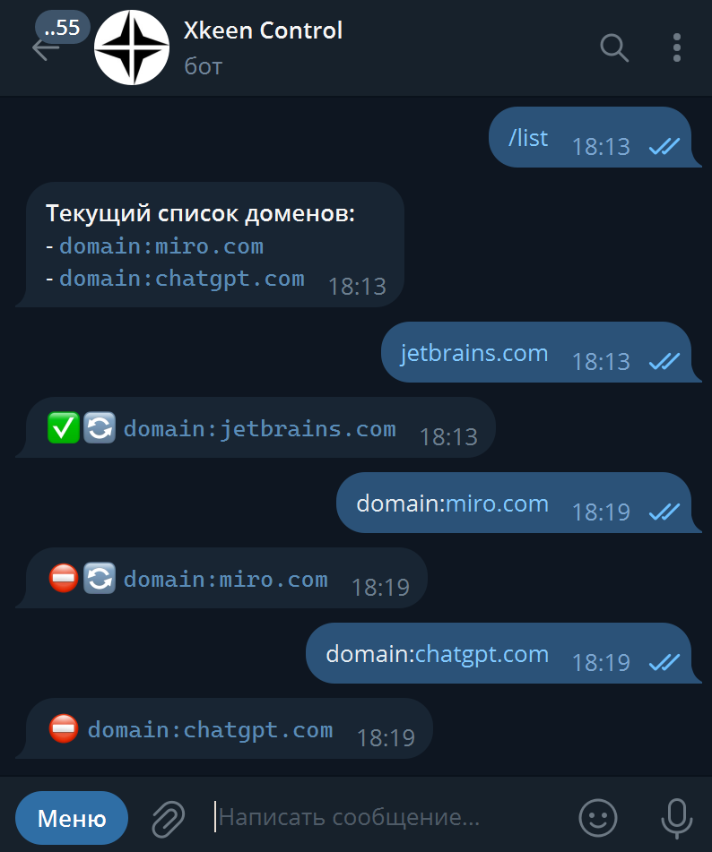

# xkeen-control

Telegram UI для управления доменным роутингом xkeen. Можно добавлять/удалять маршруты через бота.

[](docs/demo.mp4)

## Автоматическая установка на роутер

Запихиваем [файл установки](https://github.com/kontsevoye/xkeen-control/blob/master/scripts/install.sh) на роутер, делаем исполняемым, запускаем.

Например, запустив такую команду на роутере:
```shell
curl https://raw.githubusercontent.com/kontsevoye/xkeen-control/refs/heads/master/scripts/install.sh -o /opt/tmp/install.sh \
  && chmod +x /opt/tmp/install.sh \
  && /opt/tmp/install.sh
```

Если нет curl, то предварительно нужно его установить:
```shell
opkg update && opkg install curl
```

После выполнения всех действий можно отправить своему боту `/list`, он должен ответить текущим списком доменов.

## Доступные команды

```
/list - Список проксируемых доменов
/add - Добавить домен в список проксируемых
/delete - Убрать домен из списка проксируемых
/restart - Перезапустить xkeen для применения конфига
/backups - Список бэкапов конфига
/restore - Восстановить конфига из бэкапа
/help - Помощь по префиксам xray
```

Так же если отправить любую строку без слэша в начале, то будет открыто интерактивное меню добавления записи.

## Обновление

init.d укомплектован возможностью обновления. Нужно всего лишь запустить следующую команду и следовать инструкциям
```shell
/opt/etc/init.d/S52xkeencontrol update
```

## Шатауты
- https://github.com/XTLS/Xray-core
- https://github.com/Skrill0/XKeen
- https://github.com/Corvus-Malus/XKeen
